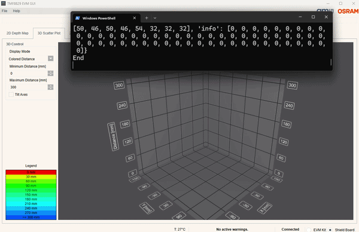

# Gesture demo application

Implementation of a simple gesture detection application, which can operate together with 
[TMF8829_EVM_DB_DEMO](https://ams-osram.com/products/boards-kits-accessories/kits/ams-tmf8829-evm-db-demo-evaluation-kit)
or [TMF8829_EVM_EB_SHIELD](https://ams-osram.com/products/boards-kits-accessories/kits/ams-tmf8829-evm-eb-shield-evaluation-kit).



## Setup

* TMF8829 device
* 3-20 cm detection range - defined in [tmf8829_gesture.py](./tmf8829/zeromq/tmf8829_gesture.py)
* 10 fps data rate - defined in [cfg_client.json](./tmf8829/zeromq/cfg_client.json)

## Gesture vocabulary
6 detections
- Swipe left
- Swipe right
- Swipe up
- Swipe down
- Palm move near
- Palm move far

Due to limited vocabulary and close range use 8x8 mode only.


## Requirements

### Virtual environment

Recommendation is to set-up a virtual environment. Open your favourite Windows PowerShell, VisualStudio Code etc.
To install a virtual environment named env, and use it:   
python -m venv env
./env/Scripts/Activate.ps1

### Install libraries

Python version 3.10.11 or higher is required.

To run the scripts in this folder you need to install the packages in the requirements.txt file with:
```bash
pip install -r requirements.txt
```

All required python packages are inside the subdirectory packages.

## Usage

See folder [tmf8829/zeromq/](./tmf8829/zeromq/) - this is the location of [tmf8829_gesture.py](./tmf8829/zeromq/tmf8829_gesture.py),
where the gesture logic is defined, but execute gesture demo with tmf8829_zeromq_client.py.

If you are using [TMF8829_EVM_EB_SHIELD](https://ams-osram.com/products/boards-kits-accessories/kits/ams-tmf8829-evm-eb-shield-evaluation-kit), 
start [tmf8829_zeromq_server.py](./tmf8829/zeromq/tmf8829_zeromq_server.py) first; this can be done with 
the pre-compiled server file from [TMF8829_Driver_ZMQ_Server_Client_EXE_\<latest version\>.zip](https://ams-osram.com/tmf8829) or inside a separate shell
```python
python tmf8829/zeromq/tmf8829_zeromq_server.py
```

If you are using [TMF8829_EVM_DB_DEMO](https://ams-osram.com/products/boards-kits-accessories/kits/ams-tmf8829-evm-db-demo-evaluation-kit), 
no additional server needs to be started.

Start the application itself:
```python
python tmf8829/zeromq/tmf8829_zeromq_client.py
```

Notes:
 - The EVM GUI can be used in parallel to this application, but needs to be started AFTER [tmf8829_zeromq_client.py](./tmf8829/zeromq/tmf8829_zeromq_client.py)

### Configuration

Update file [cfg_client.json](./tmf8829/zeromq/cfg_client.json):
- Parameter **period** [in ms] to modify speed of detection. 
- Parameter **iterations** [in k iterations] is used to change performance of detection; for short range (like 10cm-20cm) 10 or 100 is ok.

# Info

This is a fork of [tmf8829_driver_python](https://github.com/ams-OSRAM/tmf8829_driver_python) modifying files to create an application, which can run together with TMF8829_EVM_DB_DEMO or TMF8829_EVM_EB_SHIELD.